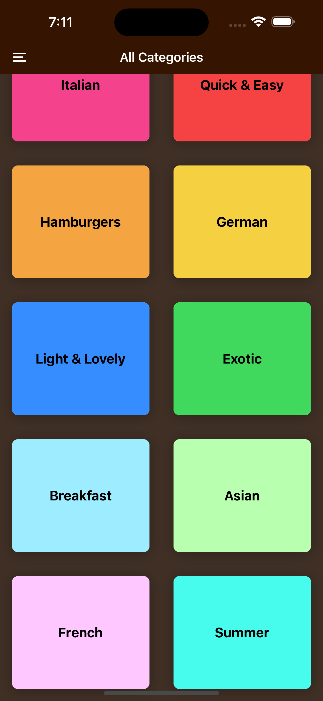
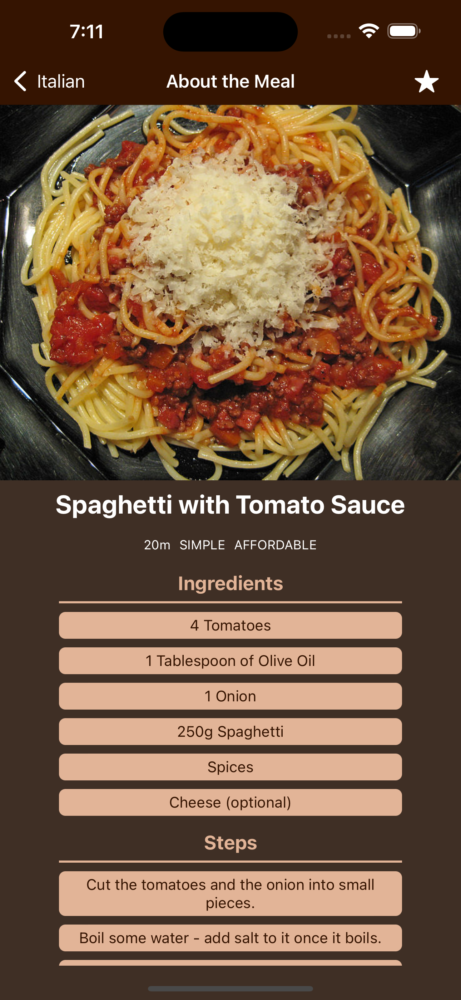
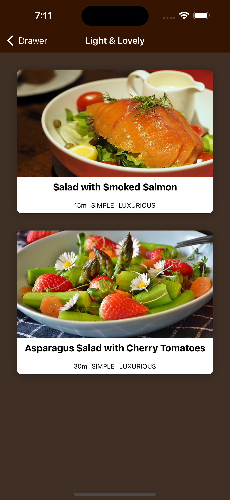
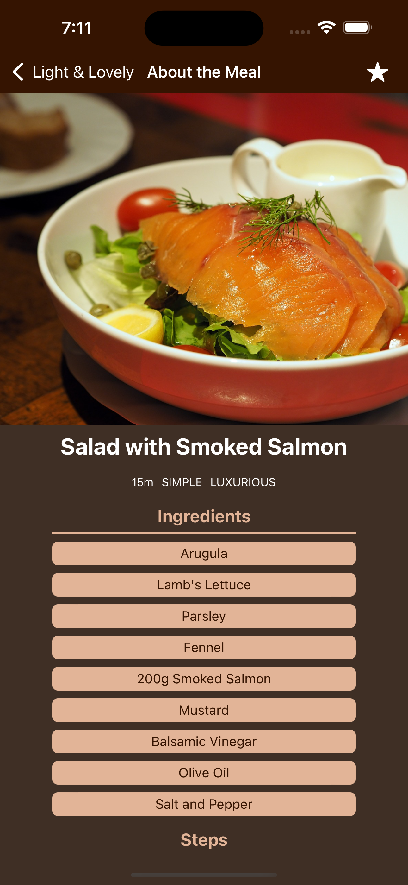
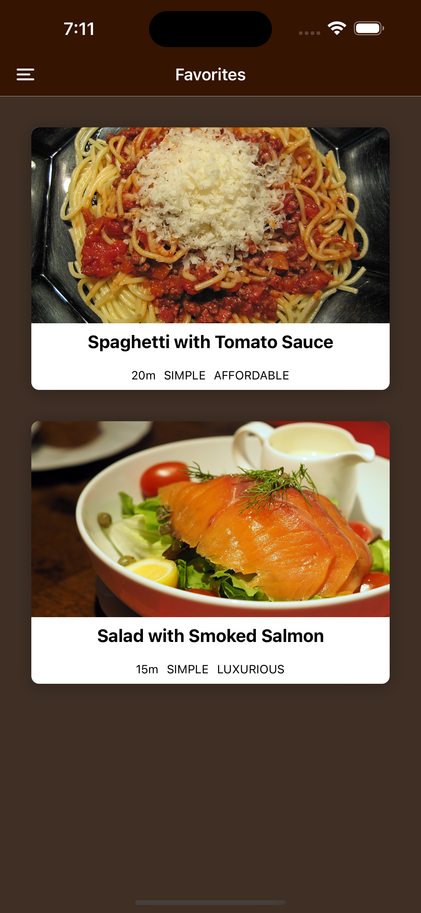
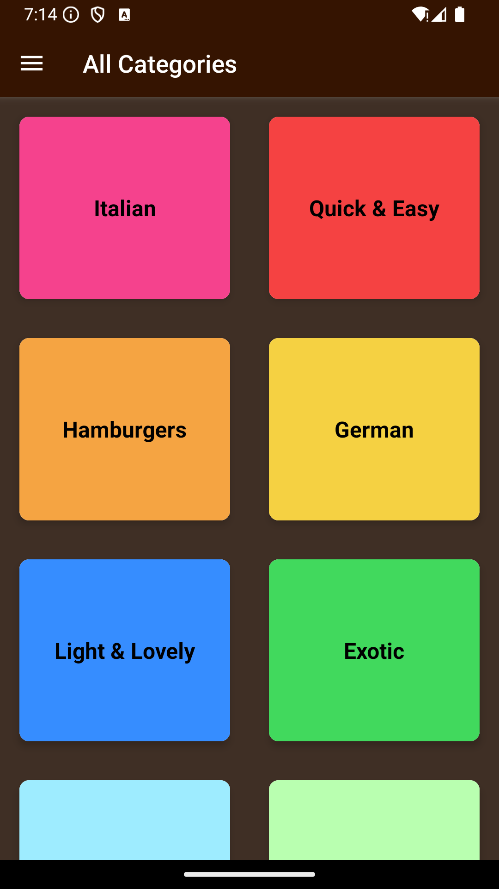
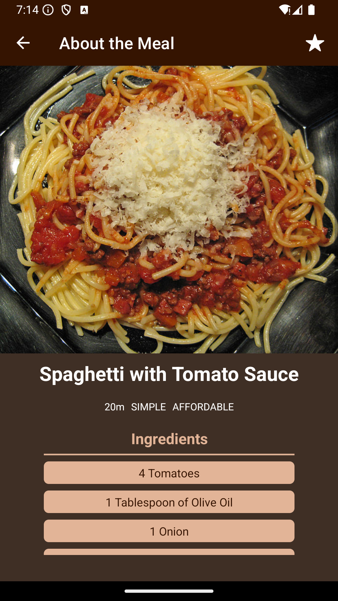
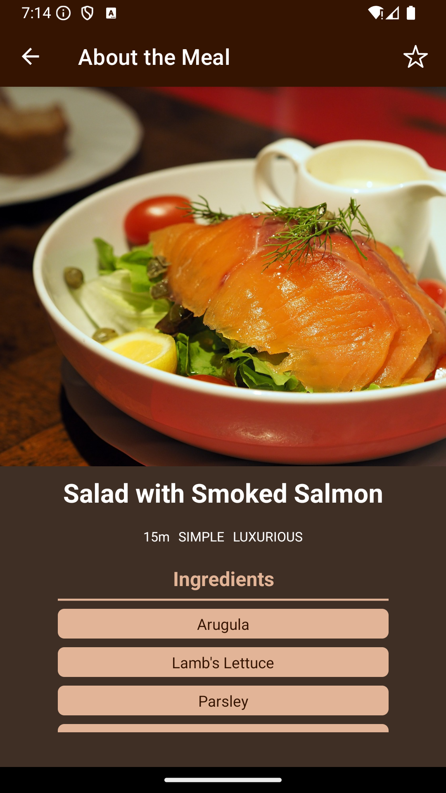
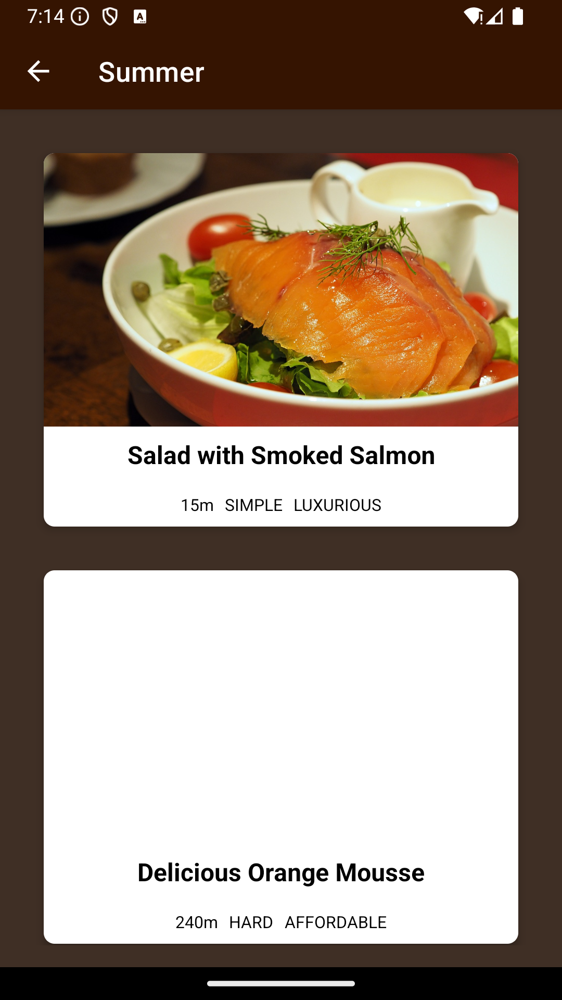
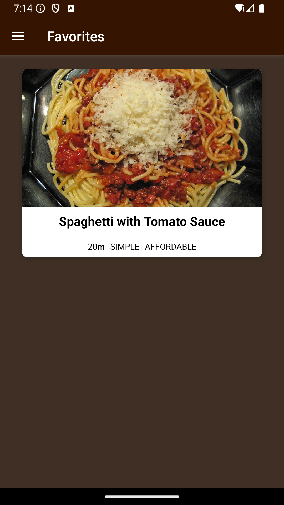

## MealsApp

A complete react native meals app with state management using redux toolkits

## Screenshots both on Android emulator and iOS simulator

## iOS simulator

 
 
 
 

## Android emulator screenshots

 
 
 
 
 

## Demo Videos

[Watch Demo Video On Android Device](https://youtu.be/OsPN3qi8TT0?si=84AZtyeZOhtAIHo1)
[Watch Demo Video On iOS Device](https://youtu.be/K7WkJWR-cGI?si=R4vBiZyzRdWJmhFH)
